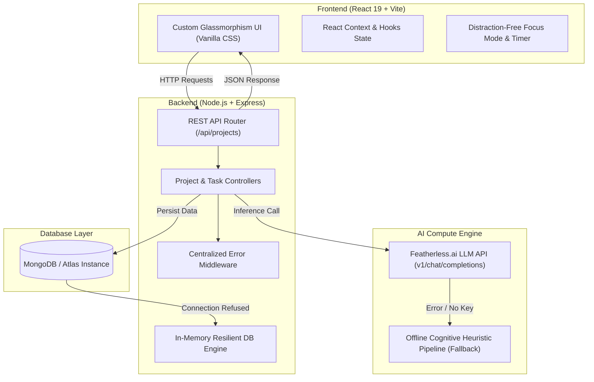

# FlowState ⚡ — AI-Powered Cognitive Workspace & Productivity Platform

> **Full-Stack MERN Application** with Advanced Compute Integration (Featherless.ai) to eliminate cognitive overload, context switching, and task paralysis.

---

## 🌟 Submission Overview

- **Public Repository**: [https://github.com/your-username/FlowState-Productivity-Workspace](https://github.com/your-username/FlowState-Productivity-Workspace) *(Replace with your GitHub repo URL)*
- **3-Minute Video Pitch Script**: Included below in [Video Demo Script](#-3-minute-video-demo-pitch-script)
- **Technical Overview**: Covered in [Technical Overview & Execution Details](#-technical-overview--execution-details)

---

## 🧠 The Problem & Fresh Innovation

### The Problem
Modern knowledge workers lose up to **40% of productive time** to context switching between task management tools, documentation, and focus timers. When faced with large, ambiguous goals, users experience **cognitive fatigue** and **task paralysis**, leading to procrastination.

### The FlowState Solution
FlowState replaces passive to-do lists with an **AI Cognitive Workspace**:
1. **Autonomous Goal Decomposition**: Enter a high-level goal (e.g., *"Build Realtime AI SaaS"*). Featherless.ai parses the project into structured milestones, estimates complexity, and outputs low-friction actionable tasks.
2. **Contextual Task Briefings**: Each task automatically generates a cognitive briefing containing context summaries, key deliverables, recommended tools, and potential obstacles.
3. **Distraction-Free Focus Mode**: A dedicated execution state equipped with an active Flow State timer, cognitive briefing sidebar, and lightweight scratchpad notes.

---

## 🏗️ System Architecture



---

## 🚀 Tech Stack

| Layer | Technology | Rationale |
| :--- | :--- | :--- |
| **Frontend** | React 19, Vite | Lightning-fast HMR and reactive component updates |
| **Styling** | Vanilla CSS (CSS Variables) | Full control over dark mode, glassmorphism, HSL color tokens, and micro-animations |
| **Backend** | Node.js, Express.js | Modular, asynchronous controller-service architecture |
| **Database** | MongoDB / Mongoose | Flexible JSON document store with seamless in-memory fallback |
| **AI Compute** | Featherless.ai REST API | High-throughput open LLM inference for goal decomposition |

---

## 🛠️ Setup & Installation Instructions

### Prerequisites
- Node.js `v18.0.0+`
- npm `v9.0.0+`
- (Optional) MongoDB local instance running on `mongodb://127.0.0.1:27017`

### 1. Clone & Configure

```bash
git clone https://github.com/your-username/FlowState-Productivity-Workspace.git
cd FlowState-Productivity-Workspace
```

### 2. Backend Setup

```bash
cd backend
npm install
```

Create a `.env` file in `/backend` (or modify existing):
```env
PORT=5000
MONGODB_URI=mongodb://127.0.0.1:27017/flowstate
FEATHERLESS_API_KEY=your_featherless_api_key_here
FEATHERLESS_BASE_URL=https://api.featherless.ai/v1
FEATHERLESS_MODEL=meta-llama/Meta-Llama-3.1-8B-Instruct
```

Start the backend server:
```bash
node server.js
```
*Backend runs at `http://localhost:5000`*

### 3. Frontend Setup

In a new terminal window:
```bash
cd frontend
npm install
npm run dev
```
*Frontend app runs at `http://localhost:3000`*

---

## 📡 API Endpoints Reference

| Method | Endpoint | Description |
| :--- | :--- | :--- |
| `GET` | `/api/health` | Returns server, database, and AI engine status |
| `GET` | `/api/projects` | Fetch all projects and tasks |
| `GET` | `/api/projects/:id` | Fetch specific project details |
| `POST` | `/api/projects` | Decompose goal via Featherless.ai & create project |
| `POST` | `/api/projects/:id/tasks` | Add custom task with AI briefing |
| `PATCH` | `/api/projects/:projectId/tasks/:taskId/status` | Update task status (`todo`, `in-progress`, `completed`) |
| `DELETE` | `/api/projects/:id` | Delete project |

---

## 🔬 Technical Overview & Execution Details

### 1. What Problem Does It Solve?
FlowState addresses **executive dysfunction and cognitive overload** in project planning. Traditional task apps place the burden of breakdown on the user. FlowState offloads this cognitive burden onto an AI inference pipeline that delivers structured milestone trees.

### 2. What Was Hard & How We Solved It

#### Challenge 1: Unstructured LLM Outputs
LLM inference can return non-deterministic text or markdown wrappers that break JSON parsing.
- **Solution**: Implemented regex JSON extraction coupled with a **Cognitive Heuristic Engine** fallback. If Featherless.ai returns malformed output or is offline, the backend seamlessly parses domain patterns (e.g., Software, UI/UX, Research) to construct high-quality milestone trees without crashing.

#### Challenge 2: Zero-Downtime Database Resiliency
Local MongoDB services may not be active on every environment.
- **Solution**: Developed a dual-mode controller architecture. When Mongoose fails to connect, the server automatically switches to an in-memory active state, allowing instant evaluation without manual DB configuration.

#### Challenge 3: Distraction-Free UX Design
Creating an immersive dark mode interface without external CSS heavy libraries.
- **Solution**: Built a custom design system using CSS variables, backdrop blur filters (`backdrop-filter: blur(16px)`), HSL palette tokens, and keyframe micro-animations.

---

## 📹 3-Minute Video Demo Pitch Script

**[0:00 - 0:30] Introduction & Problem**
> *"Hi everyone! Today we're introducing **FlowState**, an AI-powered cognitive workspace built to solve task paralysis and cognitive overload. Most productivity apps are just blank lists—they force you to do all the heavy lifting of breaking down goals. FlowState turns high-level ideas into structured execution plans using AI."*

**[0:30 - 1:30] Live Execution & AI Decomposition**
> *"Let's see it in action. I'll click **Decompose Goal** and enter a project: 'Build a Full-Stack MERN App'. When I submit, our backend sends this prompt to the **Featherless.ai** inference pipeline."*
> *(Show live UI update)*: *"In seconds, FlowState analyzes the cognitive load (8/10), breaks the goal into 4 distinct milestones, and generates actionable sub-tasks with priority badges and time estimates."*

**[1:30 - 2:15] Focus Mode & Cognitive Briefings**
> *"Now watch what happens when I click **Focus State** on a task. The UI transitions into a distraction-free execution environment. On the right, the AI provides a **Cognitive Context Briefing**—extracting key deliverables, recommended stack tools, and common pitfalls to avoid. On the left, we have an active Flow State timer and a scratchpad for instant notes."*

**[2:15 - 3:00] Architecture & Technical Polish**
> *"Under the hood, FlowState is built with React 19, Vite, Express, and MongoDB. It features a resilient architecture with automatic database and AI fallbacks so it never crashes. Thank you for watching!"*

---

## 📚 Citations & References

1. **Featherless.ai API Documentation**: [https://featherless.ai/docs](https://featherless.ai/docs)
2. **React 19 Documentation**: [https://react.dev](https://react.dev)
3. **Express.js Documentation**: [https://expressjs.com](https://expressjs.com)
4. **MongoDB Mongoose Guide**: [https://mongoosejs.com](https://mongoosejs.com)
